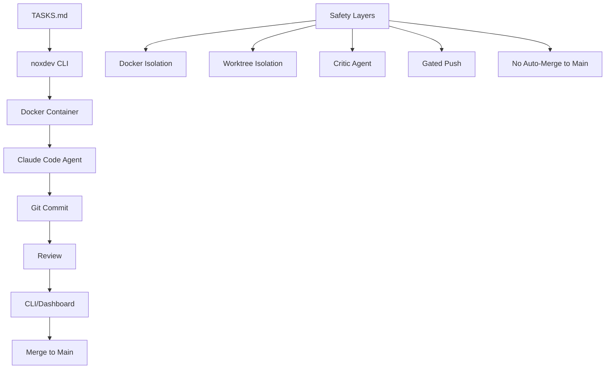

```
    ,___,
    [O.O]         
   /)   )\        
   " \|/ "
  ---m-m---
```

# noxdev

Ship code while you sleep.

[](https://www.npmjs.com/package/noxdev)
[](LICENSE)
[](https://nodejs.org/)

## What is noxdev

An open-source Node.js CLI that orchestrates autonomous coding agents. Write task specs, go to sleep, wake up to real commits on production codebases. Docker isolation, git worktree separation, and a review workflow keep your main branch safe.

## Quick Start

```bash
npm install -g @eugene218/noxdev
noxdev doctor                           # check prerequisites

cd ~/projects/my-project                # must have at least one commit
noxdev init my-project --repo .         # register the project

# write tasks in ~/worktrees/my-project/TASKS.md
noxdev run my-project                   # run task loop
noxdev status my-project                # project summary
noxdev merge my-project                 # approve/reject commits
noxdev dashboard                        # visual review UI
```

## Task Format

Tasks are defined in `TASKS.md` using this format:

```markdown
## T1: Add user authentication
- STATUS: pending
- FILES: src/auth.ts, src/middleware/auth.ts
- VERIFY: npm test && npm run build
- CRITIC: review
- PUSH: gate
- SPEC: Implement JWT-based authentication for the API.
  Add login/logout endpoints with bcrypt password hashing.
  Create middleware for route protection.
  Add unit tests for auth functions.
```

**Field explanations:**
- `STATUS`: `pending` | `done` | `failed` | `skipped`
- `FILES`: Files the task should focus on (hints, not constraints)
- `VERIFY`: Command to run after completion to validate the task
- `CRITIC`: `skip` | `review` (whether to run critic agent review)
- `PUSH`: Push strategy for the commit (see table below)
- `SPEC`: Detailed task specification

**Push strategies:**

| Strategy | Behavior |
|----------|----------|
| `auto` | Auto-commit if verify passes and critic approves |
| `gate` | Commit stays local, requires manual approval via `noxdev merge` |
| `manual` | No auto-commit, human review required |

## Architecture



The flow: **TASKS.md** → **noxdev CLI** → **Docker container** (Claude Code agent) → **git commit** → **review** (CLI or dashboard) → **merge to main**.

Safety layers include Docker isolation, worktree separation, critic agent review, gated push controls, and nothing reaching main without your sign-off.

## CLI Commands

| Command | Description |
|---------|-------------|
| `noxdev init <project>` | Register a project with git repo path. Auto-detects default branch, auto-creates initial commit if empty. |
| `noxdev run <project>` | Execute pending tasks for a project |
| `noxdev run --all` | Execute tasks across all registered projects sequentially |
| `noxdev run --overnight` | Detached background mode. Frees terminal, prevents system sleep, writes PID file. |
| `noxdev status <project>` | Show project status and last run summary |
| `noxdev log <task-id>` | Full task detail: spec, agent logs, diff, duration |
| `noxdev merge <project>` | Interactive per-commit approve/reject/diff/skip. Rejected commits are explicitly reverted. |
| `noxdev projects` | List all registered projects with last run status |
| `noxdev dashboard` | Launch React web UI for visual review (localhost:4400) |
| `noxdev doctor` | Check all prerequisites (9 checks) |
| `noxdev remove <project>` | Unregister project and clean up worktree |

## The Dashboard

A React web interface for reviewing the work. Run `noxdev dashboard` to start the local server on port 4400. The dashboard shows execution summaries, commit diffs, and provides a visual merge review workflow with dark mode. Runs on localhost only.

## Safety Model

- **Docker isolation**: Memory/CPU/timeout limits isolate agent execution
- **Git worktree**: Main branch is never directly modified, always safe
- **Nothing reaches main without review**: All commits stay local until `noxdev merge`
- **Critic agent review**: Optional second-pass validation of changes
- **Critic limitation — new files**: The critic reviews git diffs, so on greenfield projects where every file is new and untracked, the diff appears empty. This causes false rejections. Use `CRITIC: skip` for the first batch of tasks on any new project. Switch to `CRITIC: review` once there is tracked code to diff against.
- **Circuit breaker**: 3 consecutive failures automatically pause a project
- **SOPS + age encryption**: Secrets encrypted at rest, decrypted at container runtime only
- **Auto-downgrade**: If any check fails on a `PUSH: auto` task, it downgrades to `gate`

## Requirements

- Node.js >= 18
- Docker (with daemon running)
- Git
- Claude Code CLI (`claude` installed and authenticated)
- SOPS + age (optional, for secrets encryption)

## Built With

- TypeScript + commander.js (CLI)
- React 18 + Vite + Tailwind CSS (dashboard)
- better-sqlite3 (embedded database)
- Express (dashboard API)
- Battle-tested bash scripts for Docker orchestration
- Turborepo + pnpm (monorepo)

## License

[MIT](LICENSE)
