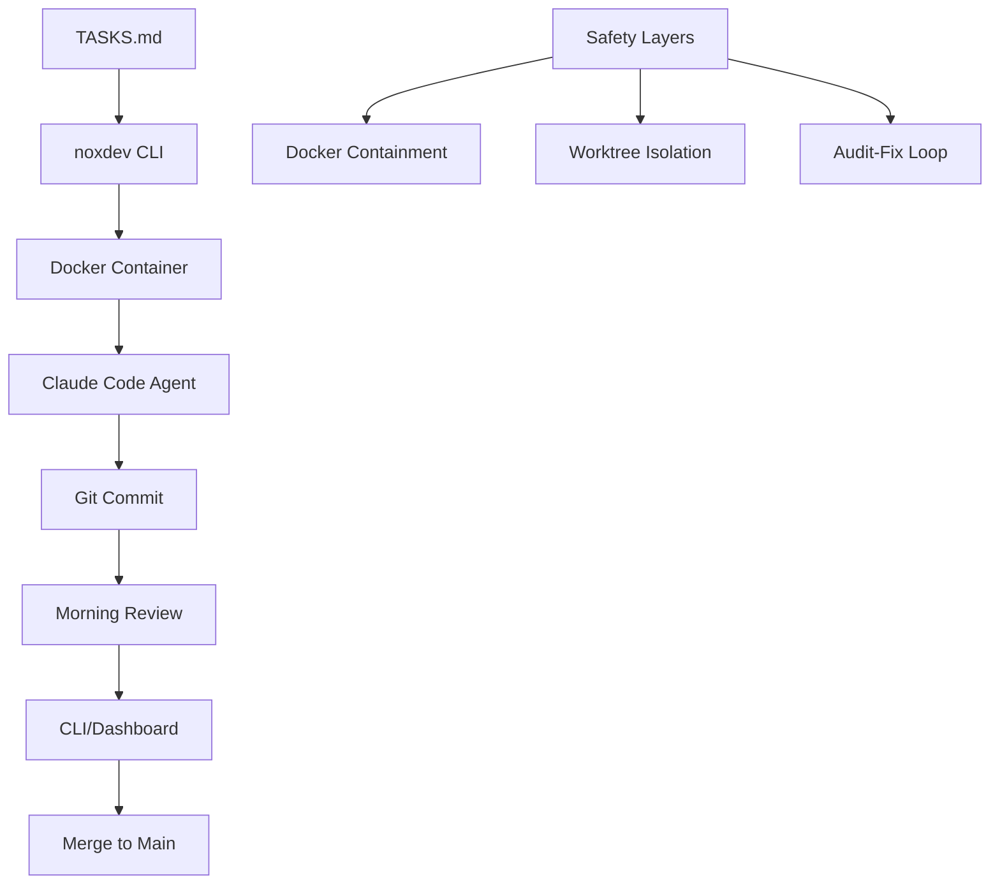

```
    ,___,
    [O.O]
   /)   )\
  " \|/ "
 ---m-m---
```

# noxdev

Ship code while you sleep

[](https://www.npmjs.com/package/@eugene218/noxdev)
[](LICENSE)
[](https://nodejs.org/)

## What is noxdev

An open-source Node.js CLI that orchestrates autonomous coding agents overnight. Write task specs, go to sleep, wake up to real commits on production codebases. Docker containment, git worktree isolation, and a morning review workflow keep your main branch safe.

## Quick Start

<div align="center">
  
</div>

```bash
npm install -g @eugene218/noxdev
noxdev doctor                           # check prerequisites
noxdev init my-project --repo ~/my-repo # register a project
# write tasks in ~/worktrees/my-project/TASKS.md
noxdev run my-project                   # run task loop
noxdev status my-project                # morning summary
# Merge when ready
cd ~/projects/my-project && git merge noxdev/my-project
noxdev dashboard                        # visual review UI
```

## Works with

noxdev is **language-agnostic** and works with any tech stack that can be containerized. The autonomous agents adapt to your codebase's language, framework, and tooling.

**Proven paths:**
- **TypeScript/JavaScript**: React, Next.js, Vue, Express, Node.js APIs
- **Python**: FastAPI, Django, Flask, data science projects, ML workflows

The agents understand your project's build systems, package managers, and testing frameworks. Whether you're building frontends, backends, APIs, or data pipelines, noxdev adapts to your development workflow.

## Task Format

Tasks are defined in `TASKS.md` using this format:

```markdown
## T1: Add user authentication
- STATUS: pending
- FILES: src/auth.ts, src/middleware/auth.ts
- VERIFY: npm test && npm run build
- SPEC: Implement JWT-based authentication for the API.
  Add login/logout endpoints with bcrypt password hashing.
  Create middleware for route protection.
  Add unit tests for auth functions.
```

**Field explanations:**
- `STATUS`: `pending` | `done` | `failed` | `skipped`
- `FILES`: Files the task should focus on (hints, not constraints)
- `VERIFY`: Command to run after completion to validate the task
- `AUDIT`: `skip` (optional — opts this task out of the audit-fix loop; otherwise the loop runs when enabled globally)
- `SPEC`: Detailed task specification

See the [`samples/`](samples/) directory for complete, real-world `TASKS.md` examples (e.g. a fullstack ride planner built from scratch).

## Architecture



The flow: **TASKS.md** → **noxdev CLI** → **Docker container** (Claude Code agent) → **git commit** → **morning review** (CLI or dashboard) → **merge to main**.

Safety layers include Docker containment, worktree isolation, and the audit-fix loop. The agent always commits its work to the worktree branch, which stays isolated until you decide to merge.

## Audit & self-correction

Once a task reaches `COMPLETED`, noxdev runs an **audit-fix loop** to catch gaps before you ever see the diff:

1. **Audit + fix** — an agent compares the task's diff against its `SPEC`, writes a gap analysis, and fixes every gap it finds.
2. **Re-audit** — a separate clean-eyes agent re-checks the work. If it confirms no gaps remain, the loop exits.
3. **Retry** — if gaps remain, the re-audit's findings are fed back into the next attempt. The loop repeats up to `max_attempts`.

If an audit container exits without producing a gap analysis, the loop aborts cleanly rather than looping on stale state. The audit agent can run on a different model than the task agent (it defaults to a stronger model for review).

Configure it in your global config (`~/.noxdev/config.*`):

```yaml
audit:
  enabled: true              # run the audit-fix loop after each completed task
  model: claude-opus-4-6     # model used for audit + re-audit
  max_attempts: 3            # max audit→fix→re-audit cycles per task
```

Opt a single task out with `AUDIT: skip` in its `TASKS.md` block.

## CLI Commands

| Command | Description |
|---------|-------------|
| `noxdev init <project>` | Register a new project with git repo path |
| `noxdev run <project>` | Execute pending tasks for a project |
| `noxdev run --all` | Execute tasks across all registered projects |
| `noxdev run --overnight` | Unattended mode with extended timeouts |
| `noxdev status <project>` | Show project status and recent execution summary |
| `noxdev log <project>` | View detailed execution history and logs |
| `noxdev cost [project]` | Token usage and cost summary with per-project breakdown (or per-run for specific project) |
| `noxdev projects` | List all registered projects |
| `noxdev dashboard` | Launch web UI for visual review (localhost only) |
| `noxdev doctor` | Check prerequisites and system health |

## The Morning Dashboard

A React web interface for reviewing overnight work. Run `noxdev dashboard` to start the local server. The dashboard shows execution summaries and commit diffs. Runs on localhost only for security.

Click a project name from Overview to see project detail. Project view shows aggregate cost + flat task table with sortable columns.

## Token-based cost tracking

noxdev captures token usage and cost per task from Claude Code session logs. The `noxdev cost` command provides detailed per-project breakdowns of API consumption across all your autonomous coding work, with options for per-run and per-task analysis.

Example output of `noxdev cost` (per-project breakdown):

```bash
$ noxdev cost

=== Token Usage & Cost Summary ===
Total projects: 3
Total tasks completed: 47

Project: web-app (15 tasks)
  Input tokens:  127,439  ($0.51)
  Output tokens:  89,234  ($0.89)
  Total cost:            $1.40

Project: api-server (20 tasks)  
  Input tokens:  203,891  ($0.82)
  Output tokens: 156,789  ($1.57)
  Total cost:            $2.39

Project: data-pipeline (12 tasks)
  Input tokens:   89,234  ($0.36)
  Output tokens:  67,123  ($0.67)
  Total cost:            $1.03

=== Global Total ===
Input tokens:  420,564  ($1.69)
Output tokens: 313,146  ($3.13)
Total cost:           $4.82

Cost: For reference, this work would have cost $4.82 via Claude API.
Actual Max usage is flat-rate - this number helps track consumption.
```

The **Cost** shows what this usage would have cost via API. Since actual Max usage is flat-rate, the dollar amount is for reference only - it helps you understand the scale of your consumption.

*Token-based cost. Max-mode tasks show equivalent API cost.*

**Cost analysis options:**
- `noxdev cost` — per-project breakdown (default)
- `noxdev cost my-project` — per-run breakdown for specific project 
- `noxdev cost --run <run-id>` — per-task breakdown for specific run
- `noxdev cost --global` — global totals across all projects

You can override pricing rates by creating `~/.noxdev/pricing.json`:

```json
{
  "input_per_million": 3.0,
  "output_per_million": 15.0
}
```

## Safety Model

- **Docker containment**: Memory/CPU/timeout limits isolate agent execution
- **Git worktree**: Main branch is never directly modified, always safe
- **Controlled merge workflow**: Commits stay on the worktree branch until you run git merge
- **Critic agent review**: Optional second-pass validation of changes
- **Circuit breaker**: 3 consecutive failures automatically pause a project
- **SOPS + age encryption**: Secure handling of secrets and credentials

## Requirements

- Node.js >= 24
- uv (install via: `curl -LsSf https://astral.sh/uv/install.sh | sh`)
- Docker (with daemon running)
- Git
- Claude CLI (`claude login` required)
- SOPS + age (optional, for secrets encryption)

**Platform support**: Linux, macOS, and Windows (via WSL2)

## Built With

Built by a single developer using AI-augmented development.

## License

[MIT](LICENSE)
